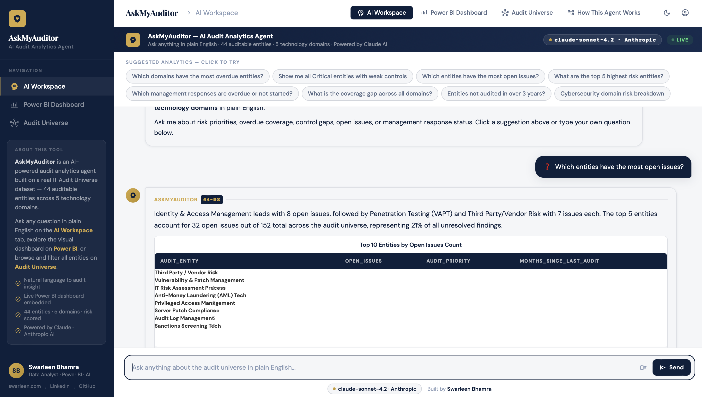

# 🔍 Ask the Auditor — AI Audit Analytics Agent

> An AI-powered conversational analytics agent built on a real IT Audit Universe dataset. Ask any question in plain English — get data-driven findings, dynamic charts, and audit recommendations instantly.

---

## 🚀 Try the App

### 👇 Click the link below to open the live app

**[https://swarleen.github.io/askmyauditor/](https://swarleen.github.io/askmyauditor/)**

> 💡 Right-click → Open in new tab to keep this page open

## 💡 What It Does

**Ask the Auditor** bridges the gap between audit data and audit insight. Instead of navigating dashboards manually, auditors and analysts can ask questions in plain English:

- *"Which domains have the most overdue entities?"*
- *"Show me all Critical entities with weak controls"*
- *"Which management responses are overdue or not started?"*
- *"What entities haven't been audited in over 3 years?"*

The AI agent returns:
- ✅ A plain English analytical answer with specific data citations
- 📊 A dynamically generated chart (bar, horizontal bar, pie)
- 📋 The underlying data table
- 🎯 A key finding — the single most important takeaway
- ⚡ An actionable audit recommendation

---

## 🧠 The AI Layer

Built on **Claude** (Anthropic) with a structured system prompt that:
- Injects the full 44-entity audit universe dataset as context
- Enforces JSON-structured responses for consistent rendering
- Constrains the model to only cite data that exists in the dataset
- Generates chart specifications that the Plotly layer renders dynamically
- Returns audit-domain language — inherent risk, residual risk, control effectiveness, audit priority

**Prompt engineering approach:**
- Schema injection — full column definitions + data types in the system prompt
- Structured output enforcement — JSON schema with required keys
- Domain grounding — model instructed to respond as a senior technology auditor
- Safety constraints — model cannot fabricate data, only analyse what exists

---

## 📊 The Dataset

**IT Audit Universe** — 44 auditable entities across 5 technology domains:

| Domain | Entities |
|---|---|
| Cybersecurity | 10 |
| Cloud & Infrastructure | 9 |
| Data Governance | 8 |
| IT Governance | 9 |
| Compliance & Regulatory | 8 |

**13 dimensions per entity:**
`Audit_Entity` · `Domain` · `Inherent_Risk_Score` · `Control_Effectiveness` · `Last_Audit_Date` · `Months_Since_Last_Audit` · `Residual_Risk_Score` · `Audit_Priority` · `Recommended_Audit_Cycle` · `Regulatory_Relevance` · `Open_Issues` · `Management_Response_Status` · `Overdue_Flag`

**Key metrics:**
- 🔴 Critical priority entities: 15
- ⏰ Overdue entities: 29
- 📋 Total open issues: 150+
- ⚠️ Weak/Not Tested controls: 18

---

## 🛠 Tech Stack

| Layer | Technology |
|---|---|
| AI / LLM | Claude (Anthropic API) |
| Web framework | Streamlit |
| Data processing | Pandas |
| Visualisation | Plotly Express |
| Data source | Excel → Pandas DataFrame |
| Visual analytics | Power BI (embedded iframe) |
| Deployment | Streamlit Cloud |
| Version control | GitHub |

---

## 🔗 Related Projects

| Project | Description | Live |
|---|---|---|
| **IT Audit Universe Dashboard** | Power BI dashboard — risk scoring, coverage gap, domain heatmap | [Open Dashboard](https://app.powerbi.com/view?r=eyJrIjoiMjQ1NDA3M2EtMTBjOC00YWJkLWIzZjktZGMzZjRhYjdjNWQzIiwidCI6IjMyMWIxNDA4LTIxZjAtNDE0My1hMzkwLTNiNjIwMmU2NWUxZiJ9) |
| **AskMyData** | NL-to-SQL AI app on cybersecurity incident data | [cyberquery-ai.streamlit.app](https://cyberquery-ai.streamlit.app) |
| **Cybersecurity Incident Tracker** | Power BI — 200 incidents, SLA, financial impact | [Open Dashboard](https://app.powerbi.com/view?r=eyJrIjoiMDgyNTA5NmYtOGU3OC00ZTMzLTk2ZGItNDVkYTBhNGFlYTk1IiwidCI6IjMyMWIxNDA4LTIxZjAtNDE0My1hMzkwLTNiNjIwMmU2NWUxZiJ9) |

---

## 👩‍💻 About

**Swarleen Bhamra** — Business Analyst & Data Analyst based in Toronto, ON.

I build data solutions that sit at the intersection of analytics, AI, and business intelligence — from Power BI dashboards and audit analytics tools to AI-powered applications that make data accessible to everyone.

| | |
|---|---|
| 🌐 Portfolio | [swarleen.com](https://www.swarleen.com) |
| 💼 LinkedIn | [linkedin.com/in/swarleenbhamra](https://www.linkedin.com/in/swarleenbhamra/) |
| 📊 Power BI Dashboards | [github.com/Swarleen/PowerBI-Portfolio](https://github.com/Swarleen/PowerBI-Portfolio) |
| 🐙 GitHub | [github.com/Swarleen](https://github.com/Swarleen) |

> 💼 Open to Data Analyst, Business Technology Analyst, Business Sstems Analyst, and Technology Analytics roles in Toronto.
> If this project resonates with what your team is building — let's connect.

---

Dataset is fictional and created for portfolio demonstration purposes only.

